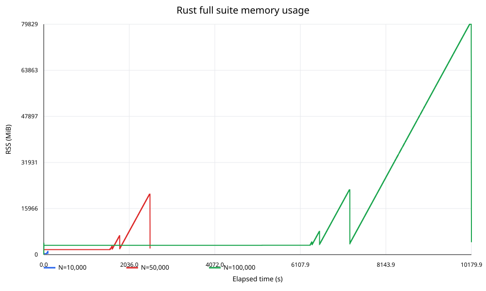
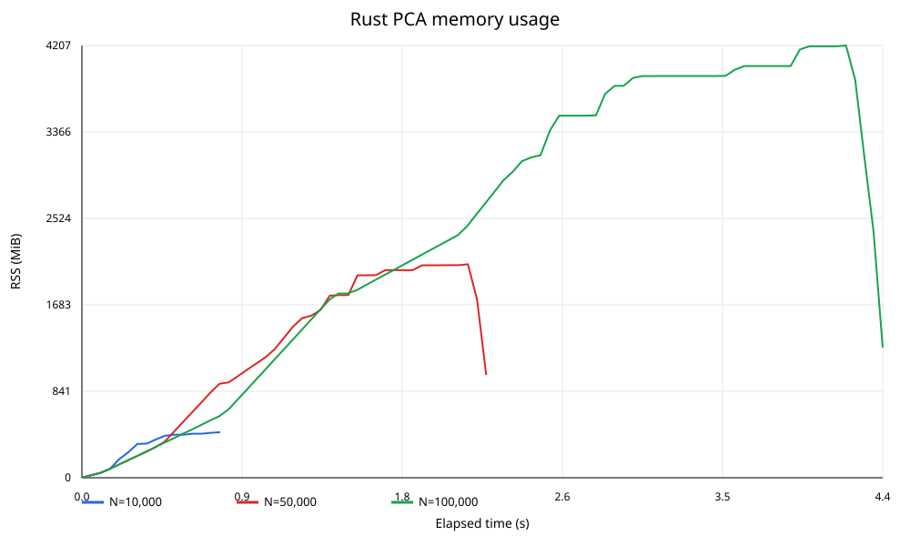
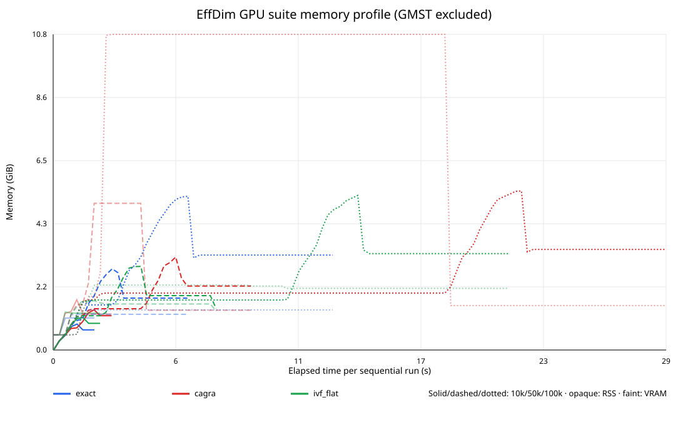
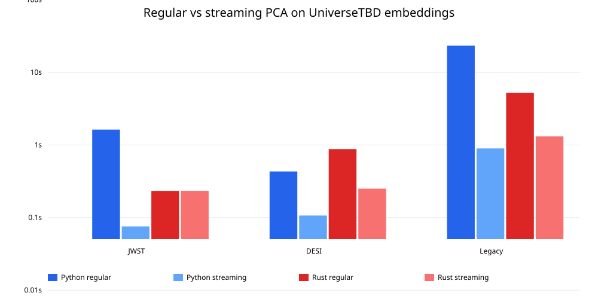

# EffDim CPU and GPU benchmark results

## Executive summary

EffDim was benchmarked on seeded standard-normal arrays with 768 features at
10,000, 50,000, and 100,000 samples.

The original CPU implementation took 2h 50m and peaked at 78 GiB for 100,000
samples. Most of this cost came from exact CPU nearest-neighbor work and GMST's
independent dense N×N distance matrix. After excluding GMST and moving k-NN to
cuVS, the optimized remaining 15 metrics completed in 6.8 seconds with exact
neighbors.

For this all-points query workload, exact GPU k-NN was faster than either
approximate backend. CAGRA and IVF-Flat remain candidates for much larger
datasets, but their indexing and traversal overhead did not pay off through
100,000 samples.

On three real UniverseTBD embedding datasets, CAGRA achieved 99.04–99.99%
recall. Rust regular PCA was 4.45× faster than Python on the 100k × 1024
Legacy Survey matrix, while Python streaming covariance was 1.47× faster than
Rust. After the new geometry and PyO3 optimizations, the fastest end-to-end
non-GMST configuration was Rust streaming PCA plus shared CAGRA at 18.32
seconds, versus 23.47 seconds for Python.

Relative to the previous Rust build, the new `rust-migration` optimizations
reduced the 100k exact-GPU 15-metric suite from 12.91 s to 6.80 s (1.90×) and
the Legacy Survey Rust streaming pipeline from 30.29 s to 18.32 s (1.65×).
On that real dataset, Rust DANCo improved from 7.34 s to 0.63 s and ESS from
1.93 s to 0.39 s.

## Benchmark environment

- Host: `angus-MS-7C56`
- CPU: AMD Ryzen 7 5700X3D, 8 cores / 16 logical CPUs
- RAM: 125 GiB
- GPU: NVIDIA RTX PRO 6000 Blackwell Max-Q, 98 GB VRAM
- GPU compute capability: 12.0
- Python: 3.12.3
- Rust: 1.97.1
- Branch: `rust-migration`
- Base source commit: `d60ef97`
- Input: seeded standard-normal arrays plus selected UniverseTBD embeddings
- Execution: sequential; only one benchmark process ran at a time
- Repetitions: one measured pass per configuration, with no warmup

The benchmark bindings and scripts were working-tree additions on top of the
listed source commit.

## 1. Original CPU full suite

This benchmark ran all 16 metrics, including exact CPU k-NN and Euclidean GMST.
The Rust extension was compiled in release mode.

| Samples | Compute time | Peak RSS | PCA dimensions at 95% |
|:---:|:---:|:---:|:---:|
| 10,000 | 100.7 s (1m 41s) | 1.12 GiB | 703 |
| 50,000 | 2,529.5 s (42m 10s) | 20.47 GiB | 720 |
| 100,000 | 10,179.3 s (2h 49m 39s) | 77.96 GiB | 723 |

The three sequential runs took approximately 3h 33m. Runtime increased by
about 101× when sample count increased by 10×, closely matching O(N²) scaling.

## 2. Spectral/PCA-only scaling

The spectral path omits all nearest-neighbor and geometry estimators.

| Samples | PCA/spectral time | Peak RSS | PCA dimensions at 95% |
|:---:|:---:|:---:|:---:|
| 10,000 | 0.62 s | 443 MiB | 703 |
| 50,000 | 1.78 s | 2.03 GiB | 720 |
| 100,000 | 3.60 s | 4.11 GiB | 723 |

### One-million-row streaming PCA follow-up

A direct 1,000,000 × 768 float64 run used a seeded standard-normal matrix,
4,096-row chunks, 16 threads, and three repetitions. The 5.72 GiB input was
memory-mapped and reused by isolated workers.

| Implementation | Best time | PCA dimensions at 95% | Peak RSS |
|:---:|:---:|:---:|:---:|
| Python NumPy/OpenBLAS | 3.437 s | 728 | 5.82 GiB |
| Rust ndarray/OpenBLAS | 4.154 s | 728 | 5.80 GiB |
| Rust faer GEMM | 6.354 s | 728 | 5.81 GiB |

This validates one-million-row streaming PCA on the host. Rust OpenBLAS was
1.21× slower than Python and 1.53× faster than faer. Peak RSS is dominated by
resident pages from the memory-mapped input, rather than PCA workspace alone.

## 3. Isolated GPU nearest-neighbor experiments

NVIDIA cuVS 26.6 with CUDA 13 was tested using exact brute force, CAGRA, and
IVF-Flat. Recall was measured against exact GPU neighbors on 1,000 queries.

### Exact cuVS k-NN

| Samples | All-points k-NN time | Recall@10 |
|:---:|:---:|:---:|
| 10,000 | 0.0148 s | 100% |
| 50,000 | 0.324 s | 100% |
| 100,000 | 1.40 s | 100% |

### ANN trade-offs at 100,000 samples

| Backend and setting | Recall@10 | All-points search | Peak VRAM |
|:---:|:---:|:---:|:---:|
| CAGRA, `itopk=128` | 40.22% | 0.90 s | 1.72 GiB |
| CAGRA, `itopk=1024` | 91.34% | 7.99 s | 6.30 GiB |
| CAGRA, `itopk=2048` | 98.19% | 15.88 s | 10.80 GiB |
| IVF-Flat, `nprobe=128/316` | 57.58% | 4.67 s | 2.45 GiB |
| IVF-Flat, `nprobe=256/316` | 91.00% | 9.51 s | 2.23 GiB |
| IVF-Flat, all 316 lists | 100% | 6.86 s | 2.23 GiB |
| Exact cuVS brute force | 100% | 1.40 s | about 1.4 GiB |

Random Gaussian vectors in 768 dimensions are difficult for ANN because
distances are highly concentrated. Recall and speed on real embedding data may
differ materially.

The available FAISS CUDA wheel installed successfully but failed at runtime
with `CUDA error 209: no kernel image is available for execution on the
device`. That wheel did not contain kernels for the RTX workstation GPU's
`sm_120` architecture. cuVS CUDA 13 worked correctly.

## 4. GPU-backed 15-metric suite, GMST excluded

This benchmark replaced Rust's exact CPU k-NN with each cuVS backend. It ran
the eight spectral metrics and seven k-NN-based geometry metrics. GMST was
excluded because it separately constructs dense N×N distance matrices and
would hide the effect of changing the k-NN backend.

CAGRA was tuned for approximately 98% recall. IVF-Flat searched 80% of its
coarse lists and achieved approximately 90% recall.

| Samples | Backend | Total time | k-NN time | Recall@10 | Peak RSS | Peak VRAM |
|:---:|:---:|:---:|:---:|:---:|:---:|:---:|
| 10,000 | Exact cuVS | 1.59 s | 0.015 s | 100% | 0.90 GiB | 1.10 GiB |
| 10,000 | CAGRA | 2.14 s | 0.107 s | 99.35% | 1.37 GiB | 1.35 GiB |
| 10,000 | IVF-Flat | 1.84 s | 0.059 s | 89.44% | 1.11 GiB | 1.26 GiB |
| 50,000 | Exact cuVS | 3.19 s | 0.317 s | 100% | 2.78 GiB | 1.22 GiB |
| 50,000 | CAGRA | 6.10 s | 2.361 s | 98.05% | 3.24 GiB | 5.02 GiB |
| 50,000 | IVF-Flat | 4.20 s | 1.212 s | 89.71% | 3.09 GiB | 1.68 GiB |
| 100,000 | Exact cuVS | 6.80 s | 1.373 s | 100% | 4.98 GiB | 1.37 GiB |
| 100,000 | CAGRA | 22.31 s | 15.816 s | 98.33% | 5.63 GiB | 10.80 GiB |
| 100,000 | IVF-Flat | 14.78 s | 9.127 s | 90.56% | 5.29 GiB | 2.23 GiB |

At 100,000 samples, the CAGRA estimates remained close to exact despite 98.33%
neighbor recall. For example, MLE dimensionality differed by 0.46% and
Two-NN differed by 0.21%. IVF-Flat's approximately 90% recall produced MLE and
Two-NN differences below 1% on this synthetic dataset.

## Conclusions

1. Exact cuVS is the best tested k-NN backend through 100,000 samples. Its
   batched all-points workload efficiently saturates the GPU, while ANN index
   traversal adds more overhead than it saves.
2. CAGRA provides a useful high-recall fallback for datasets where exact GPU
   search eventually becomes too expensive. At 100,000 samples, however, its
   98% recall configuration was more than 11× slower than exact GPU k-NN.
3. IVF-Flat used less VRAM than high-recall CAGRA but its tested 80%-probe
   configuration delivered only about 90% recall and was still slower than
   exact search.
4. Replacing k-NN alone is insufficient for the original 16-metric suite.
   GMST's dense pairwise matrix is the remaining quadratic memory bottleneck
   and needs a sparse, batched, sampled, or separately reported implementation.
5. A one-million-sample full-suite run is not practical until GMST is
   redesigned. Streaming PCA is demonstrated at one million samples; the
   GPU-backed non-GMST suite remains the next full-pipeline scaling candidate.

## 5. Python main versus Rust on UniverseTBD embeddings

### Scope

This comparison uses the current pure-Python implementation from `main`
at commit `d1e7af9` and the Rust migration based on commit `d60ef97`.
Both implementations consume the **same CAGRA distances and neighbor
indices**. GMST is excluded. Streaming PCA means chunked Chan covariance
accumulation followed by covariance eigendecomposition, using float64
accumulation and a 4,096-row chunk size in both languages.

All runs were sequential and used one measured pass. Timings therefore
include normal run-to-run noise; sub-millisecond scalar metric timings
should be treated as directional rather than as stable microbenchmarks.

### Real datasets

| Dataset | Shape | CAGRA build | CAGRA search | Recall@10 |
|:---:|:---:|:---:|:---:|:---:|
| JWST | 1,496 × 1,024 | 0.836 s | 0.033 s | 99.55% |
| DESI | 20,465 × 768 | 0.781 s | 0.576 s | 99.04% |
| Legacy Survey | 100,000 × 1,024 | 0.902 s | 15.312 s | 99.99% |

The Legacy Survey input is capped at 100,000 rows. Only the selected
embedding columns were streamed from Hugging Face; the full 108 GB
repository was not downloaded.

### PCA comparison

| Dataset | Python regular | Rust regular | Advantage | Python streaming | Rust streaming | Advantage |
|:---:|:---:|:---:|:---:|:---:|:---:|:---:|
| JWST | 1.629 s | 0.233 s | 6.99× Rust | 0.075 s | 0.233 s | 3.09× Python |
| DESI | 0.432 s | 0.878 s | 2.03× Python | 0.107 s | 0.250 s | 2.34× Python |
| Legacy Survey | 23.314 s | 5.240 s | 4.45× Rust | 0.895 s | 1.312 s | 1.47× Python |

| Dataset | Python PCA-95 | Rust PCA-95 | Python peak RSS | Rust peak RSS |
|:---:|:---:|:---:|:---:|:---:|
| JWST | 145 | 145 | 0.29 GiB | 0.10 GiB |
| DESI | 64 | 64 | 1.56 GiB | 0.85 GiB |
| Legacy Survey | 110 | 110 | 9.54 GiB | 5.25 GiB |

> **PCA result:** Rust regular SVD wins decisively on the small JWST
> and large Legacy Survey matrices, but NumPy wins on the medium DESI
> shape. Python streaming covariance is currently faster on all three
> datasets. On the 100k × 1,024 matrix, the OpenBLAS-backed Rust path
> completed in 1.31 s versus 0.90 s for Python.

Python `main` switches to randomized SVD when both matrix dimensions
are at least 1,000, while Rust regular PCA remains exact. Streaming
covariance provides an exact common reference and avoids that algorithm
difference.

#### PCA numerical agreement

| Dataset | Python regular vs streaming | Rust regular vs streaming | Python vs Rust streaming |
|:---:|:---:|:---:|:---:|
| JWST | 2.51e-14 | 9.34e-05 | 3.42e-02 |
| DESI | 1.48e-10 | 1.71e-10 | 3.19e-10 |
| Legacy Survey | 3.25e-02 | 1.90e-05 | 1.89e-04 |

Values are the maximum relative difference across the eight spectral
dimensionality outputs. The larger Python regular-path differences on
the 1,024-feature datasets come from its randomized-SVD branch and
omission of the final component.

### End-to-end non-GMST pipeline

These totals add shared CAGRA build/search, PCA, scalar spectral
metrics, and the seven geometry estimators. Rust uses its bundled
geometry path so data conversion and neighbor arrays are shared once.

| Dataset | Python regular total | Rust regular total | Python streaming total | Rust streaming total |
|:---:|:---:|:---:|:---:|:---:|
| `jwst_dinov3_vitl16` | 2.593 s | 1.110 s | 1.040 s | 1.111 s |
| `desi_dinov3_small_vitl16` | 2.758 s | 2.354 s | 2.433 s | 1.726 s |
| `legacysurvey_dinov3_vitl16` | 45.884 s | 22.250 s | 23.465 s | 18.321 s |

### Per-estimator comparison

#### `jwst_dinov3_vitl16`

| Estimator | Python | Rust | Speed advantage | Relative value difference |
|:---:|:---:|:---:|:---:|:---:|
| PCA explained variance (95%) | 41.2 µs | 8.1 µs | 5.11× Rust | 0.00e+00 |
| Participation ratio | 14.1 µs | 3.7 µs | 3.84× Rust | 4.53e-15 |
| Shannon entropy | 31.7 µs | 8.1 µs | 3.91× Rust | 5.31e-15 |
| Rényi α=2 | 7.5 µs | 14.6 µs | 1.95× Python | 1.51e-16 |
| Rényi α=3 | 33.7 µs | 12.5 µs | 2.68× Rust | 4.48e-15 |
| Rényi α=4 | 23.5 µs | 12.4 µs | 1.89× Rust | 6.42e-15 |
| Rényi α=5 | 23.1 µs | 12.5 µs | 1.85× Rust | 5.42e-15 |
| Geometric mean | 40.1 µs | 9.1 µs | 4.38× Rust | 3.43e-02 |
| MLE | 188.9 µs | 378.3 µs | 2.00× Python | 8.21e-08 |
| Two-NN | 120.1 µs | 257.9 µs | 2.15× Python | 3.14e-08 |
| DANCo | 62.50 ms | 6.56 ms | 9.52× Rust | 9.27e-10 |
| MiND-MLi | 91.0 µs | 343.8 µs | 3.78× Python | 2.62e-08 |
| MiND-MLk | 243.0 µs | 298.0 µs | 1.23× Python | 2.42e-07 |
| ESS | 31.35 ms | 2.38 ms | 13.15× Rust | 1.96e-08 |
| TLE | 154.9 µs | 461.8 µs | 2.98× Python | 1.46e-07 |

#### `desi_dinov3_small_vitl16`

| Estimator | Python | Rust | Speed advantage | Relative value difference |
|:---:|:---:|:---:|:---:|:---:|
| PCA explained variance (95%) | 44.6 µs | 8.5 µs | 5.25× Rust | 0.00e+00 |
| Participation ratio | 14.0 µs | 3.5 µs | 3.97× Rust | 2.87e-15 |
| Shannon entropy | 26.3 µs | 6.6 µs | 3.97× Rust | 3.53e-15 |
| Rényi α=2 | 7.0 µs | 13.1 µs | 1.86× Python | 6.56e-15 |
| Rényi α=3 | 29.0 µs | 9.6 µs | 3.00× Rust | 3.74e-15 |
| Rényi α=4 | 19.0 µs | 9.6 µs | 1.98× Rust | 3.39e-15 |
| Rényi α=5 | 18.6 µs | 9.6 µs | 1.93× Rust | 2.83e-15 |
| Geometric mean | 37.2 µs | 8.1 µs | 4.58× Rust | 4.83e-15 |
| MLE | 1.35 ms | 36.67 ms | 27.15× Python | 3.20e-10 |
| Two-NN | 477.9 µs | 34.54 ms | 72.28× Python | 4.27e-08 |
| DANCo | 588.17 ms | 92.48 ms | 6.36× Rust | 4.41e-08 |
| MiND-MLi | 180.7 µs | 32.58 ms | 180.36× Python | 7.91e-08 |
| MiND-MLk | 1.23 ms | 34.09 ms | 27.78× Python | 4.04e-07 |
| ESS | 366.59 ms | 54.65 ms | 6.71× Rust | 1.09e-07 |
| TLE | 1.01 ms | 34.57 ms | 34.19× Python | 3.20e-10 |

#### `legacysurvey_dinov3_vitl16`

| Estimator | Python | Rust | Speed advantage | Relative value difference |
|:---:|:---:|:---:|:---:|:---:|
| PCA explained variance (95%) | 41.7 µs | 9.6 µs | 4.34× Rust | 0.00e+00 |
| Participation ratio | 13.7 µs | 3.7 µs | 3.66× Rust | 4.23e-15 |
| Shannon entropy | 29.7 µs | 12.2 µs | 2.42× Rust | 7.11e-15 |
| Rényi α=2 | 6.8 µs | 19.3 µs | 2.82× Python | 1.35e-15 |
| Rényi α=3 | 33.8 µs | 12.9 µs | 2.61× Rust | 1.02e-15 |
| Rényi α=4 | 23.6 µs | 12.5 µs | 1.89× Rust | 4.36e-16 |
| Rényi α=5 | 23.2 µs | 12.6 µs | 1.84× Rust | 4.73e-16 |
| Geometric mean | 39.7 µs | 9.2 µs | 4.33× Rust | 3.27e-02 |
| MLE | 9.40 ms | 233.41 ms | 24.83× Python | 4.38e-08 |
| Two-NN | 1.95 ms | 224.67 ms | 114.95× Python | 7.01e-08 |
| DANCo | 3.863 s | 630.36 ms | 6.13× Rust | 2.09e-09 |
| MiND-MLi | 617.1 µs | 229.77 ms | 372.37× Python | 8.25e-08 |
| MiND-MLk | 6.03 ms | 231.55 ms | 38.43× Python | 3.31e-07 |
| ESS | 2.404 s | 385.04 ms | 6.24× Rust | 9.85e-08 |
| TLE | 4.90 ms | 238.28 ms | 48.66× Python | 4.38e-08 |

### Interpretation

1. **CAGRA is accurate on real embeddings.** Recall@10 ranges from
   99.04% to 99.99%, substantially better than on isotropic Gaussian
   vectors at comparable settings.
2. **Rust regular PCA is shape-dependent but strong at scale.** It is
   about 4.5× faster than Python regular PCA on the 100k × 1024 Legacy
   Survey matrix, while NumPy is faster on the 20k × 768 DESI matrix.
3. **Python streaming PCA remains faster in isolation, but Rust wins the
   optimized pipeline.** On the 100k × 1,024 matrix, streaming PCA took
   0.90 s in Python and 1.31 s in Rust. Faster Rust geometry reduced the
   complete non-GMST pipeline to 18.32 s versus 23.47 s for Python.
4. **Estimator values agree closely.** Geometry outputs use identical
   CAGRA neighbors and agree to numerical precision. Differences in
   regular spectral results primarily reflect Python's randomized-SVD
   branch, not a language-level discrepancy.
5. **Cheap per-method Rust calls pay conversion overhead.** Several
   simple geometry estimators look slower through individual PyO3
   calls because each call converts the full input to float32 and
   copies precomputed distances. The bundled Rust geometry path shares
   those conversions and is the relevant end-to-end implementation.
