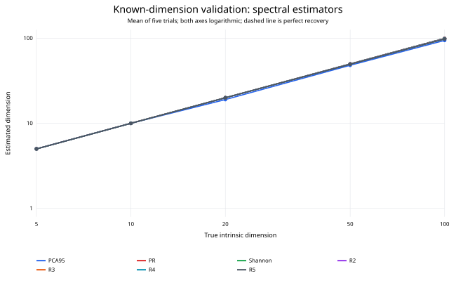
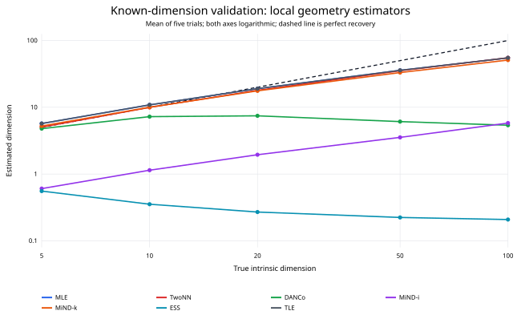

# EffDim validation on known-dimensional manifolds

Five independent isotropic Gaussian datasets were generated at each true
dimension (5, 10, 20, 50, and 100), with 10,000 samples embedded into a
random 256-dimensional linear subspace. Exact GPU neighbours used `k=10`.

## Main findings

1. **Participation ratio, Shannon effective rank, and Rényi dimensions recover
   the known linear rank almost exactly.** Even at dimension 100 their means
   lie between 97.6 and 99.5.
2. **PCA-95 behaves according to its definition:** 5, 10, 19, 48, and 94.2.
   It is a 95%-variance rank rather than an unbiased intrinsic-dimension estimate.
3. **MLE, TLE, Two-NN, and MiND-MLk work through dimension 20 but underestimate
   high dimensions severely.** At true dimension 100 they return about 51–55,
   showing finite-sample and `k=10` limitations.
4. **DANCo saturates near 5–7, MiND-MLi remains far too low, and the simplified
   ESS statistic decreases toward 0.2.** These implementations should not be
   selected as general dimension estimators from stability alone.
5. **Geometric-mean ED is numerically invalid on rank-deficient embeddings.**
   Null covariance directions drive enormous values instead of the known rank.

## Spectral estimators

## Local geometry estimators

## Mean estimates

| Method | d=5 | d=10 | d=20 | d=50 | d=100 |
|:---:|---:|---:|---:|---:|---:|
| PCA-95 | 5.000 | 10.000 | 19.000 | 48.000 | 94.200 |
| Participation ratio | 4.998 | 9.990 | 19.960 | 49.736 | 99.007 |
| Shannon ED | 4.999 | 9.995 | 19.980 | 49.867 | 99.499 |
| Rényi α=2 | 4.998 | 9.990 | 19.960 | 49.736 | 99.007 |
| Rényi α=3 | 4.997 | 9.986 | 19.941 | 49.606 | 98.525 |
| Rényi α=4 | 4.995 | 9.981 | 19.921 | 49.477 | 98.056 |
| Rényi α=5 | 4.994 | 9.976 | 19.902 | 49.351 | 97.600 |
| Geometric mean ED | 6.472e+14 | 3.248e+14 | 8.056e+13 | 1.221e+12 | 1.288e+09 |
| MLE | 5.716 | 10.862 | 19.012 | 35.808 | 55.022 |
| Two-NN | 5.045 | 9.967 | 17.932 | 35.263 | 55.199 |
| DANCo | 4.793 | 7.242 | 7.449 | 6.100 | 5.386 |
| MiND-MLi | 0.605 | 1.142 | 1.945 | 3.538 | 5.803 |
| MiND-MLk | 5.248 | 10.023 | 17.613 | 33.147 | 51.017 |
| ESS | 0.555 | 0.353 | 0.270 | 0.224 | 0.208 |
| TLE | 5.716 | 10.862 | 19.012 | 35.808 | 55.022 |