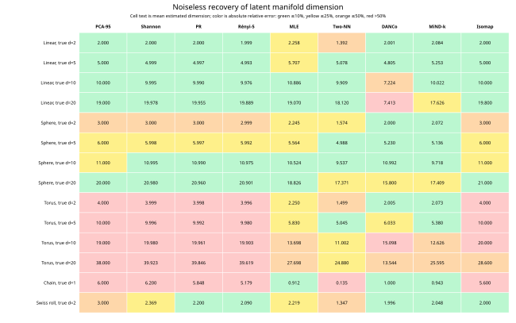
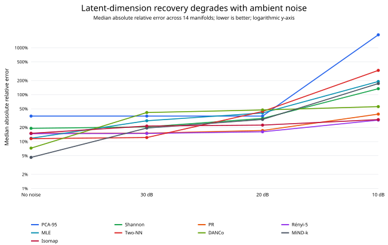
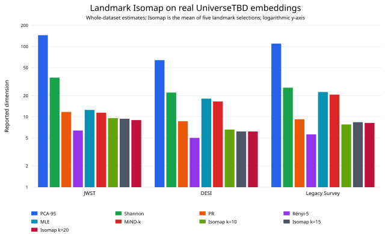

# EffDim recovery on noisy embedded manifolds

Linear subspaces, spheres, tori, a nonlinear chain, and a Swiss roll were
sampled with 10,000 points, randomly embedded into 256 dimensions, and
evaluated over five replicates. Core estimators used exact GPU neighbours;
Landmark Isomap used a CAGRA `k=10` graph with 512 landmarks.

## Main findings

1. **On clean manifolds, MiND-MLk is best overall by median relative error
   (4.6%), followed by DANCo (7.3%), Two-NN (11.6%), and MLE/TLE (11.8%).**
   No local method is uniformly best: DANCo saturates on higher dimensions,
   while Two-NN badly underestimates the nonlinear chain.
2. **Landmark Isomap exactly recovers clean linear subspaces and the Swiss
   roll, but its median clean error is 15%.** Closed topology prevents a
   globally isometric Euclidean unfolding: spheres return about d+1 and
   tori about 2d. The nonlinear chain's `k=10` graph retains only about 46%
   of points in its largest component, invalidating that estimate.
3. **Spectral metrics measure global embedding span, not nonlinear latent
   dimension.** A sphere of intrinsic dimension d spans d+1 linear axes;
   a d-torus spans 2d; and the one-dimensional chain has PCA-95 of 6.
4. **At 30 dB, Two-NN has the lowest selected-method median error (12.2%),**
   followed by participation ratio (15.1%) and MiND-MLk (19.5%). Local
   neighbourhood geometry is already measurably distorted.
5. **At 20 dB, participation ratio is best by median error (17.3%).** Isomap
   follows at 22.5%; selected local estimators rise to approximately 30–47%.
6. **At 10 dB, none of the methods reliably recovers the clean latent
   dimension.** Gaussian ambient noise makes support dimension 256; PCA-95
   is particularly inflated, with median error around 1,890%.
7. **There is no universal winner.** MiND-MLk is strongest for clean manifold
   recovery, participation ratio is comparatively robust to moderate noise,
   Isomap is useful for unfoldable connected manifolds, and PCA-95 remains
   a global variance/compression dimension.
8. **On the real embeddings, Landmark Isomap is stable from k=10 to k=20.**
   JWST estimates are 9.6, 9.4, and 9.0; DESI 6.6, 6.2, and 6.2; and
   Legacy Survey 7.8, 8.4, and 8.2. Every graph remains fully connected,
   and each dataset spans at most 0.6 dimensions across neighbourhood sizes.
   These values align more closely with participation ratio and higher-order
   Rényi dimensions than PCA-95, but no ground truth is available.

## Clean-manifold recovery matrix

## Noise sensitivity

## Median absolute relative error across all shapes

| Method | No noise | 30 dB | 20 dB | 10 dB |
|:---:|---:|---:|---:|---:|
| PCA-95 | 35.0% | 35.0% | 35.0% | 1890.0% |
| Participation ratio | 15.0% | 15.1% | 17.3% | 38.6% |
| Shannon ED | 19.2% | 20.6% | 31.2% | 134.3% |
| Rényi α=2 | 15.0% | 15.1% | 17.3% | 38.6% |
| Rényi α=3 | 14.9% | 15.0% | 16.5% | 31.8% |
| Rényi α=4 | 14.8% | 15.0% | 16.3% | 29.8% |
| Rényi α=5 | 14.8% | 14.9% | 16.2% | 28.7% |
| Geometric mean ED | 8807103441170767.0% | 14620.8% | 1494.4% | 86.5% |
| MLE | 11.8% | 27.8% | 40.7% | 191.2% |
| Two-NN | 11.6% | 12.2% | 43.9% | 329.7% |
| DANCo | 7.3% | 41.7% | 47.3% | 55.7% |
| MiND-MLi | 68.2% | 66.0% | 77.5% | 69.9% |
| MiND-MLk | 4.6% | 19.5% | 29.7% | 172.7% |
| ESS | 87.3% | 88.4% | 91.4% | 95.3% |
| TLE | 11.8% | 27.8% | 40.7% | 191.2% |
| Landmark Isomap | 15.0% | 21.5% | 22.5% | 29.5% |

## Mean noiseless estimates

| Shape | True d | PCA-95 | Shannon | PR | Rényi-5 | MLE | Two-NN | DANCo | MiND-k | Isomap |
|:---:|---:|---:|---:|---:|---:|---:|---:|---:|---:|---:|
| Linear | 2 | 2.000 | 2.000 | 2.000 | 1.999 | 2.258 | 1.392 | 2.001 | 2.084 | 2.000 |
| Linear | 5 | 5.000 | 4.999 | 4.997 | 4.993 | 5.707 | 5.078 | 4.805 | 5.253 | 5.000 |
| Linear | 10 | 10.000 | 9.995 | 9.990 | 9.976 | 10.886 | 9.909 | 7.224 | 10.022 | 10.000 |
| Linear | 20 | 19.000 | 19.978 | 19.955 | 19.889 | 19.070 | 18.120 | 7.413 | 17.626 | 19.800 |
| Sphere | 2 | 3.000 | 3.000 | 3.000 | 2.999 | 2.245 | 1.574 | 2.000 | 2.072 | 3.000 |
| Sphere | 5 | 6.000 | 5.998 | 5.997 | 5.992 | 5.564 | 4.988 | 5.230 | 5.136 | 6.000 |
| Sphere | 10 | 11.000 | 10.995 | 10.990 | 10.975 | 10.524 | 9.537 | 10.992 | 9.718 | 11.000 |
| Sphere | 20 | 20.000 | 20.980 | 20.960 | 20.901 | 18.826 | 17.371 | 15.800 | 17.409 | 21.000 |
| Torus | 2 | 4.000 | 3.999 | 3.998 | 3.996 | 2.250 | 1.499 | 2.005 | 2.073 | 4.000 |
| Torus | 5 | 10.000 | 9.996 | 9.992 | 9.980 | 5.830 | 5.045 | 6.033 | 5.380 | 10.000 |
| Torus | 10 | 19.000 | 19.980 | 19.961 | 19.903 | 13.698 | 11.002 | 15.098 | 12.626 | 20.000 |
| Torus | 20 | 38.000 | 39.923 | 39.846 | 39.619 | 27.698 | 24.880 | 13.544 | 25.595 | 28.600 |
| Chain | 1 | 6.000 | 6.200 | 5.848 | 5.179 | 0.912 | 0.135 | 1.000 | 0.943 | 5.600 |
| Swiss roll | 2 | 3.000 | 2.369 | 2.200 | 2.090 | 2.219 | 1.347 | 1.996 | 2.048 | 2.000 |

## Landmark Isomap on real embeddings

All CAGRA `k=10`, `k=15`, and `k=20` graphs formed one connected component
containing 100% of the data. Isomap entries are mean ± SD across five
independent landmark selections. Other methods are deterministic.

| Method | JWST | DESI | Legacy Survey |
|:---:|---:|---:|---:|
| PCA-95 | 145.000 | 64.000 | 110.000 |
| Shannon ED | 36.134 | 22.157 | 25.981 |
| Participation ratio | 11.752 | 8.659 | 9.241 |
| Rényi α=5 | 6.388 | 5.027 | 5.633 |
| MLE | 12.560 | 18.172 | 22.560 |
| MiND-MLk | 11.464 | 16.539 | 20.712 |
| Landmark Isomap k=10 | 9.6 ± 0.9 | 6.6 ± 0.9 | 7.8 ± 0.8 |
| Landmark Isomap k=15 | 9.4 ± 0.5 | 6.2 ± 0.4 | 8.4 ± 1.1 |
| Landmark Isomap k=20 | 9.0 ± 0.0 | 6.2 ± 0.4 | 8.2 ± 1.1 |

The accompanying CSV contains mean, standard deviation, and relative error
for all 15 non-GMST methods plus Isomap under every synthetic shape and
noise condition.