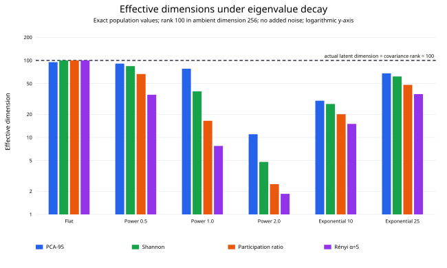
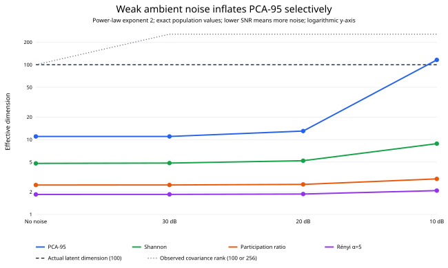

# EffDim under eigenvalue decay and ambient noise

Synthetic covariance spectra used rank 100 in 256 ambient dimensions,
10,000 observations, and five trials per condition. Population targets are
known exactly and compared with the sample covariance implementation.

## Main findings

1. **The actual latent dimension is 100 in every condition.** Without noise,
   covariance rank is also 100. Any nonzero isotropic ambient noise makes the
   population covariance full-rank at 256.
2. **The earlier agreement was a special property of the flat spectrum.**
   With power-law exponent 1 and no noise, PCA-95 is 78 while Shannon is
   39.68, participation ratio is 16.46, and Rényi α=5 is 7.76.
3. **Steeper decay increases the disagreement dramatically.** At exponent 2,
   the same metrics are 11, 4.81, 2.47, and 1.85 even though algebraic rank
   remains 100.
4. **A weak, broad noise floor can make PCA-95 large without materially changing
   dominant-direction metrics.** For exponent 2, moving from no noise to
   10 dB raises PCA-95 from 11 to 116, but participation ratio only from
   2.47 to 2.98 and Rényi α=5 from 1.85 to 2.08.
5. **This reproduces the qualitative real-data pattern:** a few dominant
   directions plus many weak directions can yield high PCA-95 and low
   Shannon/Rényi dimensions simultaneously.
6. **Sample estimates closely track exact population definitions.** The largest
   discrepancy is 6.9% for PCA-95 under the noisiest condition; most
   continuous effective-rank errors are around 0–2.5%.

## Spectrum-shape effect

## Noise-floor effect

## Exact population dimensions without noise

| Spectrum | Actual latent d | Covariance rank | PCA-95 | Shannon | Participation ratio | Rényi α=5 |
|:---:|---:|---:|---:|---:|---:|---:|
| Flat | 100 | 100 | 95.000 | 100.000 | 100.000 | 100.000 |
| Power 0.5 | 100 | 100 | 91.000 | 84.412 | 66.618 | 35.871 |
| Power 1.0 | 100 | 100 | 78.000 | 39.677 | 16.458 | 7.758 |
| Power 2.0 | 100 | 100 | 11.000 | 4.808 | 2.470 | 1.848 |
| Exponential 10 | 100 | 100 | 30.000 | 27.181 | 20.015 | 14.984 |
| Exponential 25 | 100 | 100 | 68.000 | 61.919 | 48.208 | 36.542 |

## Actual dimension versus effective dimensions under noise

| SNR | Actual latent d | Covariance rank | PCA-95 | Shannon | Participation ratio | Rényi α=5 |
|:---:|---:|---:|---:|---:|---:|---:|
| No noise | 100 | 100 | 11.000 | 4.808 | 2.470 | 1.848 |
| 30 dB | 100 | 256 | 11.000 | 4.854 | 2.475 | 1.851 |
| 20 dB | 100 | 256 | 13.000 | 5.216 | 2.519 | 1.871 |
| 10 dB | 100 | 256 | 116.000 | 8.821 | 2.982 | 2.081 |

## Sample-to-population accuracy across all 24 conditions

| Method | Median relative error | Maximum relative error |
|:---:|---:|---:|
| PCA-95 | 0.94% | 6.90% |
| Participation ratio | 0.40% | 1.16% |
| Shannon ED | 0.44% | 0.83% |
| Rényi α=2 | 0.40% | 1.16% |
| Rényi α=3 | 0.30% | 1.56% |
| Rényi α=4 | 0.26% | 2.02% |
| Rényi α=5 | 0.26% | 2.47% |