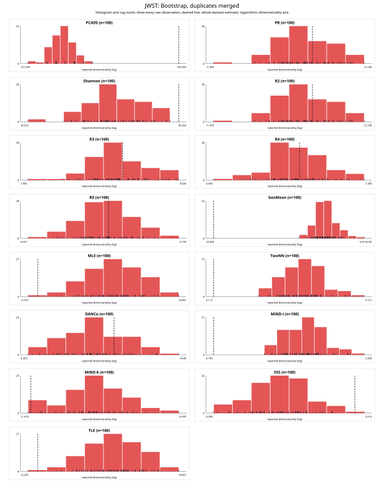
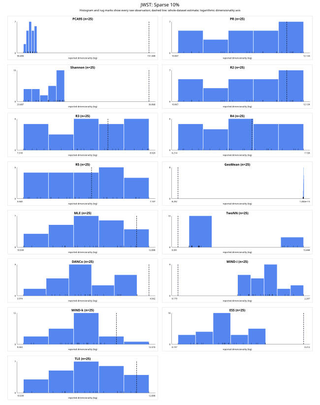
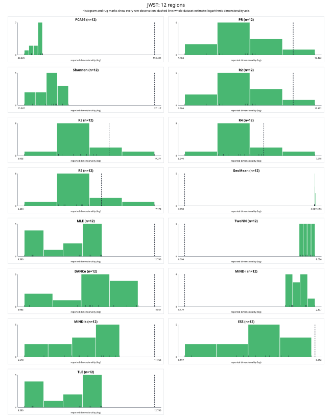
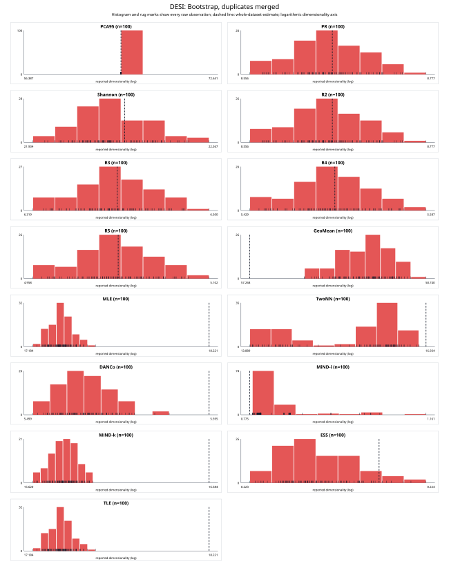
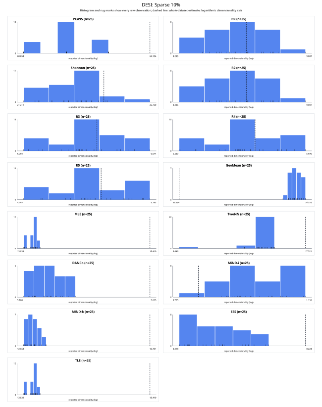
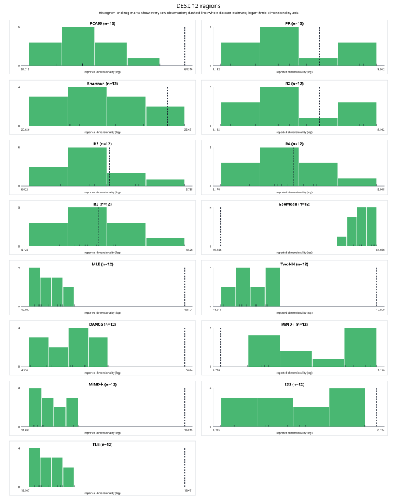
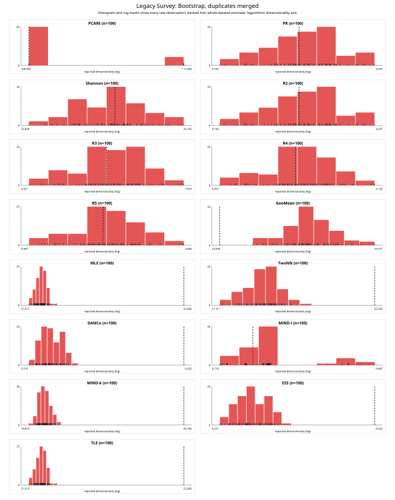
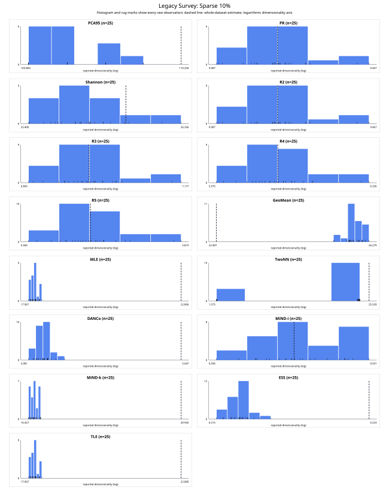
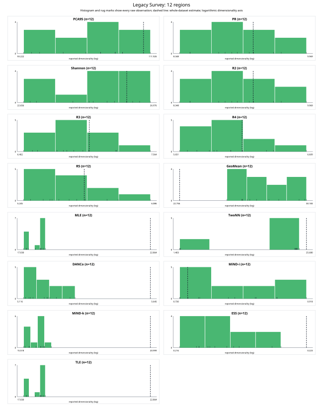

# EffDim stability across UniverseTBD embedding samples

## Experiment

Each dataset was evaluated four ways: the complete matrix; 100 row-bootstrap
replicates; 25 uniform 10% samples without replacement; and 12 contiguous,
nearly equal stored-order chunks. Repeated draws in each bootstrap replicate
were merged into one unique row. All 15 non-GMST methods used streaming covariance and
exact cuVS GPU neighbours (`k=10`).

The contiguous chunks test sensitivity to stored row order. They are not
physical sky regions because the embedding matrices contain no coordinates.

## Main findings

1. **The simplified ESS proxy has the lowest normalized spread, but it is not
   a calibrated dimension estimate.** Its median relative standard deviations
   are 0.116% for bootstrap samples,
   0.512% for 10% samples, and
   1.183% for regions. This indicates repeatability only.
2. **Large-dataset spectral estimates are stable.** On DESI and Legacy Survey,
   participation ratio and all Rényi dimensions remain close to the complete
   dataset under bootstrap, 10% sampling, and region splits. Region CVs are
   approximately 2–5%.
3. **JWST is too small for 12-way high-dimensional spectral comparisons.**
   Each region has only about 125 rows but 1,024 features, imposing a rank
   ceiling. PCA-95 falls from 145 to 47–55 and geometric-mean ED becomes
   numerically dominated by the null spectrum.
4. **Deduplicated bootstrap avoids artificial zero-distance clouds.** It
   behaves as a random unique subset containing about 63% of the rows, so
   remaining differences primarily reflect sample-size sensitivity.
5. **ESS and DANCo are the most region-stable geometry methods.** ESS region
   CV is 0.7–1.9% and DANCo is 1.2–3.4% across the three datasets.
6. **Agreement across regions does not imply agreement with the whole set.**
   MLE/TLE regions have low internal CV but systematically return only about
   75–81% of the whole-dataset estimate, demonstrating sample-size bias.
7. **Two-NN is sensitive to ties already present in these embeddings.** Its
   Legacy Survey region CV is 53.5%, and the whole JWST estimate (0.115)
   is inconsistent with its region estimates (about 4–7).

## Stability ranking

Lower relative standard deviation means better repeatability. The bias column
is also required: a method can have low spread while being consistently far
from its whole-dataset estimate. Values are medians across datasets, and the
overall columns are medians across all three schemes and datasets.

| Method | Bootstrap RSD | Sparse RSD | Region RSD | Overall RSD | Overall absolute bias |
|:---:|---:|---:|---:|---:|---:|
| ESS | 0.116% | 0.512% | 1.183% | 0.512% | 2.00% |
| PCA-95 | 0.351% | 1.032% | 2.155% | 1.032% | 5.45% |
| DANCo | 0.226% | 0.995% | 1.907% | 1.041% | 5.92% |
| MLE | 0.330% | 0.748% | 2.368% | 1.306% | 18.72% |
| TLE | 0.330% | 0.748% | 2.368% | 1.306% | 18.72% |
| Shannon ED | 0.357% | 1.396% | 3.455% | 1.396% | 3.01% |
| MiND-MLk | 0.391% | 0.999% | 2.754% | 1.485% | 19.21% |
| Rényi α=2 | 0.479% | 1.848% | 4.885% | 1.848% | 0.65% |
| Participation ratio | 0.479% | 1.848% | 4.885% | 1.848% | 0.65% |
| Rényi α=3 | 0.538% | 2.039% | 4.489% | 2.039% | 0.67% |
| Rényi α=5 | 0.555% | 2.060% | 4.028% | 2.060% | 0.76% |
| Rényi α=4 | 0.556% | 2.081% | 4.215% | 2.081% | 0.74% |
| Geometric mean ED | 0.340% | 1.599% | 6.673% | 3.980% | 28.21% |
| Two-NN | 4.050% | 33.292% | 33.521% | 6.572% | 18.46% |
| MiND-MLi | 7.503% | 12.156% | 15.229% | 12.038% | 19.46% |

## Whole-dataset estimates

| Method | JWST | DESI | Legacy Survey |
|:---:|:---:|:---:|:---:|
| PCA-95 | 145.000 | 64.000 | 110.000 |
| Participation ratio | 11.752 | 8.659 | 9.241 |
| Shannon ED | 36.134 | 22.157 | 25.981 |
| Rényi α=2 | 11.752 | 8.659 | 9.241 |
| Rényi α=3 | 8.334 | 6.405 | 6.978 |
| Rényi α=4 | 7.053 | 5.505 | 6.105 |
| Rényi α=5 | 6.388 | 5.027 | 5.633 |
| Geometric mean ED | 29.822 | 57.334 | 23.050 |
| MLE | 12.560 | 18.172 | 22.560 |
| Two-NN | 0.115 | 16.782 | 22.502 |
| DANCo | 4.533 | 5.591 | 5.620 |
| MiND-MLi | 0.201 | 0.789 | 0.747 |
| MiND-MLk | 11.464 | 16.539 | 20.712 |
| ESS | 0.211 | 0.224 | 0.222 |
| TLE | 12.560 | 18.172 | 22.560 |

## Sampled dimensionality distributions

Each panel is a histogram of the raw reported dimensionalities. Short rug
marks at the baseline show every individual observation, and the dashed
vertical line is the whole-dataset estimate. Horizontal axes are logarithmic.
The tables separately provide compact mean ± SD summaries.

### JWST

| Method | Whole dataset | Bootstrap mean ± SD | Sparse mean ± SD | Regions mean ± SD |
|:---:|---:|---:|---:|---:|
| PCA-95 | 145.000 | 131.750 ± 1.344 | 62.360 ± 1.497 | 52.500 ± 2.468 |
| Participation ratio | 11.752 | 11.705 ± 0.176 | 11.175 ± 0.587 | 10.637 ± 0.676 |
| Shannon ED | 36.134 | 35.075 ± 0.467 | 26.188 ± 1.085 | 23.590 ± 1.249 |
| Rényi α=2 | 11.752 | 11.705 ± 0.176 | 11.175 ± 0.587 | 10.637 ± 0.676 |
| Rényi α=3 | 8.334 | 8.315 ± 0.133 | 8.137 ± 0.466 | 7.863 ± 0.514 |
| Rényi α=4 | 7.053 | 7.041 ± 0.119 | 6.944 ± 0.425 | 6.743 ± 0.433 |
| Rényi α=5 | 6.388 | 6.379 ± 0.111 | 6.318 ± 0.404 | 6.145 ± 0.386 |
| Geometric mean ED | 29.822 | 1.096e+03 ± 421.538 | 3.658e+12 ± 1.537e+11 | 9.762e+12 ± 3.089e+11 |
| MLE | 12.560 | 13.305 ± 0.272 | 11.777 ± 0.595 | 9.927 ± 0.832 |
| Two-NN | 0.115 | 0.134 ± 0.005 | 2.119 ± 3.634 | 5.176 ± 0.809 |
| DANCo | 4.533 | 4.505 ± 0.047 | 4.263 ± 0.121 | 4.276 ± 0.145 |
| MiND-MLi | 0.201 | 0.294 ± 0.024 | 1.082 ± 0.389 | 1.531 ± 0.247 |
| MiND-MLk | 11.464 | 12.054 ± 0.294 | 10.650 ± 0.538 | 8.702 ± 0.968 |
| ESS | 0.211 | 0.209 ± 0.001 | 0.202 ± 0.003 | 0.205 ± 0.004 |
| TLE | 12.560 | 13.305 ± 0.272 | 11.777 ± 0.595 | 9.927 ± 0.832 |

#### Individual contiguous-region estimates

| Method | Whole | R1 | R2 | R3 | R4 | R5 | R6 |
|:---:|:---:|:---:|:---:|:---:|:---:|:---:|:---:|
| PCA-95 | 145.000 | 52.000 | 54.000 | 55.000 | 47.000 | 50.000 | 52.000 |
| Participation ratio | 11.752 | 10.698 | 10.778 | 10.242 | 9.915 | 10.175 | 12.264 |
| Shannon ED | 36.134 | 23.091 | 23.819 | 23.647 | 21.126 | 22.458 | 25.338 |
| Rényi α=2 | 11.752 | 10.698 | 10.778 | 10.242 | 9.915 | 10.175 | 12.264 |
| Rényi α=3 | 8.334 | 8.065 | 7.955 | 7.512 | 7.509 | 7.562 | 9.153 |
| Rényi α=4 | 7.053 | 6.984 | 6.787 | 6.442 | 6.500 | 6.503 | 7.815 |
| Rényi α=5 | 6.388 | 6.392 | 6.157 | 5.878 | 5.945 | 5.933 | 7.080 |
| Geometric mean ED | 29.822 | 9.390e+12 | 9.579e+12 | 9.766e+12 | 9.461e+12 | 9.561e+12 | 9.928e+12 |
| MLE | 12.560 | 9.706 | 10.847 | 10.182 | 8.738 | 8.922 | 8.956 |
| Two-NN | 0.115 | 5.675 | 6.100 | 4.972 | 4.557 | 4.462 | 4.885 |
| DANCo | 4.533 | 4.463 | 4.417 | 4.457 | 4.247 | 4.269 | 4.275 |
| MiND-MLi | 0.201 | 1.310 | 1.748 | 2.054 | 1.207 | 1.379 | 1.376 |
| MiND-MLk | 11.464 | 8.504 | 9.982 | 9.362 | 6.852 | 7.405 | 8.262 |
| ESS | 0.211 | 0.211 | 0.206 | 0.206 | 0.208 | 0.208 | 0.207 |
| TLE | 12.560 | 9.706 | 10.847 | 10.182 | 8.738 | 8.922 | 8.956 |

| Method | R7 | R8 | R9 | R10 | R11 | R12 |
|:---:|:---:|:---:|:---:|:---:|:---:|:---:|
| PCA-95 | 53.000 | 53.000 | 55.000 | 50.000 | 54.000 | 55.000 |
| Participation ratio | 10.849 | 10.711 | 10.859 | 9.504 | 10.905 | 10.748 |
| Shannon ED | 24.178 | 24.118 | 24.739 | 21.837 | 24.036 | 24.693 |
| Rényi α=2 | 10.849 | 10.711 | 10.859 | 9.504 | 10.905 | 10.748 |
| Rényi α=3 | 7.996 | 7.856 | 7.883 | 6.998 | 8.121 | 7.741 |
| Rényi α=4 | 6.849 | 6.734 | 6.705 | 6.018 | 7.017 | 6.565 |
| Rényi α=5 | 6.234 | 6.145 | 6.086 | 5.502 | 6.433 | 5.955 |
| Geometric mean ED | 9.445e+12 | 9.672e+12 | 9.760e+12 | 1.035e+13 | 1.004e+13 | 1.020e+13 |
| MLE | 10.225 | 10.517 | 10.467 | 8.939 | 10.827 | 10.801 |
| Two-NN | 5.672 | 4.006 | 5.126 | 4.176 | 6.556 | 5.923 |
| DANCo | 4.029 | 4.263 | 4.363 | 4.216 | 4.299 | 4.010 |
| MiND-MLi | 1.467 | 1.413 | 1.738 | 1.347 | 1.759 | 1.578 |
| MiND-MLk | 8.519 | 9.293 | 8.807 | 8.027 | 9.587 | 9.822 |
| ESS | 0.198 | 0.203 | 0.204 | 0.205 | 0.204 | 0.198 |
| TLE | 10.225 | 10.517 | 10.467 | 8.939 | 10.827 | 10.801 |

### DESI

| Method | Whole dataset | Bootstrap mean ± SD | Sparse mean ± SD | Regions mean ± SD |
|:---:|---:|---:|---:|---:|
| PCA-95 | 64.000 | 64.000 ± 0 | 62.040 ± 0.676 | 60.083 ± 1.379 |
| Participation ratio | 8.659 | 8.655 ± 0.042 | 8.614 ± 0.160 | 8.545 ± 0.229 |
| Shannon ED | 22.157 | 22.131 ± 0.079 | 21.823 ± 0.309 | 21.425 ± 0.542 |
| Rényi α=2 | 8.659 | 8.655 ± 0.042 | 8.614 ± 0.160 | 8.545 ± 0.229 |
| Rényi α=3 | 6.405 | 6.402 ± 0.034 | 6.372 ± 0.131 | 6.350 ± 0.186 |
| Rényi α=4 | 5.505 | 5.503 ± 0.031 | 5.477 ± 0.115 | 5.471 ± 0.172 |
| Rényi α=5 | 5.027 | 5.026 ± 0.028 | 5.002 ± 0.104 | 5.003 ± 0.162 |
| Geometric mean ED | 57.334 | 58.208 ± 0.195 | 73.659 ± 0.917 | 80.919 ± 2.282 |
| MLE | 18.172 | 17.376 ± 0.060 | 14.284 ± 0.136 | 13.705 ± 0.430 |
| Two-NN | 16.782 | 15.526 ± 0.859 | 13.483 ± 1.103 | 12.915 ± 0.516 |
| DANCo | 5.591 | 5.529 ± 0.013 | 5.205 ± 0.056 | 5.116 ± 0.107 |
| MiND-MLi | 0.789 | 0.830 ± 0.059 | 0.962 ± 0.096 | 1.010 ± 0.120 |
| MiND-MLk | 16.539 | 15.814 ± 0.065 | 13.075 ± 0.165 | 12.459 ± 0.456 |
| ESS | 0.224 | 0.223 ± 2.605e-04 | 0.220 ± 0.001 | 0.219 ± 0.003 |
| TLE | 18.172 | 17.376 ± 0.060 | 14.284 ± 0.136 | 13.705 ± 0.430 |

#### Individual contiguous-region estimates

| Method | Whole | R1 | R2 | R3 | R4 | R5 | R6 |
|:---:|:---:|:---:|:---:|:---:|:---:|:---:|:---:|
| PCA-95 | 64.000 | 61.000 | 60.000 | 60.000 | 61.000 | 61.000 | 63.000 |
| Participation ratio | 8.659 | 8.845 | 8.369 | 8.216 | 8.541 | 8.598 | 8.864 |
| Shannon ED | 22.157 | 22.182 | 21.133 | 21.072 | 21.602 | 21.894 | 22.345 |
| Rényi α=2 | 8.659 | 8.845 | 8.369 | 8.216 | 8.541 | 8.598 | 8.864 |
| Rényi α=3 | 6.405 | 6.521 | 6.191 | 6.054 | 6.312 | 6.314 | 6.536 |
| Rényi α=4 | 5.505 | 5.590 | 5.321 | 5.201 | 5.423 | 5.408 | 5.603 |
| Rényi α=5 | 5.027 | 5.098 | 4.862 | 4.753 | 4.952 | 4.932 | 5.108 |
| Geometric mean ED | 57.334 | 79.373 | 82.993 | 80.960 | 80.614 | 79.155 | 76.190 |
| MLE | 18.172 | 13.119 | 13.401 | 14.067 | 13.933 | 13.432 | 13.456 |
| Two-NN | 16.782 | 12.768 | 12.594 | 13.706 | 12.107 | 12.667 | 12.646 |
| DANCo | 5.591 | 5.216 | 5.121 | 5.177 | 5.045 | 5.175 | 5.270 |
| MiND-MLi | 0.789 | 0.955 | 0.875 | 1.038 | 0.882 | 1.106 | 1.155 |
| MiND-MLk | 16.539 | 11.887 | 12.106 | 12.832 | 12.752 | 12.234 | 11.992 |
| ESS | 0.224 | 0.222 | 0.220 | 0.219 | 0.218 | 0.221 | 0.223 |
| TLE | 18.172 | 13.119 | 13.401 | 14.067 | 13.933 | 13.432 | 13.456 |

| Method | R7 | R8 | R9 | R10 | R11 | R12 |
|:---:|:---:|:---:|:---:|:---:|:---:|:---:|
| PCA-95 | 58.000 | 58.000 | 60.000 | 59.000 | 60.000 | 60.000 |
| Participation ratio | 8.519 | 8.472 | 8.471 | 8.258 | 8.925 | 8.466 |
| Shannon ED | 21.119 | 20.705 | 21.226 | 20.724 | 21.847 | 21.250 |
| Rényi α=2 | 8.519 | 8.472 | 8.471 | 8.258 | 8.925 | 8.466 |
| Rényi α=3 | 6.331 | 6.390 | 6.336 | 6.156 | 6.751 | 6.300 |
| Rényi α=4 | 5.452 | 5.547 | 5.479 | 5.318 | 5.872 | 5.435 |
| Rényi α=5 | 4.984 | 5.090 | 5.018 | 4.872 | 5.392 | 4.973 |
| Geometric mean ED | 83.335 | 83.617 | 79.750 | 84.043 | 80.033 | 80.968 |
| MLE | 13.267 | 13.655 | 14.321 | 14.021 | 14.414 | 13.381 |
| Two-NN | 13.298 | 13.026 | 12.174 | 13.335 | 13.041 | 13.613 |
| DANCo | 5.254 | 5.055 | 5.128 | 4.963 | 5.026 | 4.959 |
| MiND-MLi | 0.982 | 0.845 | 1.173 | 0.891 | 1.139 | 1.082 |
| MiND-MLk | 12.018 | 12.255 | 13.060 | 12.878 | 13.193 | 12.296 |
| ESS | 0.223 | 0.219 | 0.218 | 0.215 | 0.216 | 0.216 |
| TLE | 13.267 | 13.655 | 14.321 | 14.021 | 14.414 | 13.381 |

### Legacy Survey

| Method | Whole dataset | Bootstrap mean ± SD | Sparse mean ± SD | Regions mean ± SD |
|:---:|---:|---:|---:|---:|
| PCA-95 | 110.000 | 110.180 ± 0.386 | 107.000 ± 0.957 | 102.583 ± 5.435 |
| Participation ratio | 9.241 | 9.244 ± 0.023 | 9.240 ± 0.082 | 9.055 ± 0.451 |
| Shannon ED | 25.981 | 25.974 ± 0.052 | 25.765 ± 0.202 | 24.943 ± 1.355 |
| Rényi α=2 | 9.241 | 9.244 ± 0.023 | 9.240 ± 0.082 | 9.055 ± 0.451 |
| Rényi α=3 | 6.978 | 6.981 ± 0.020 | 6.980 ± 0.071 | 6.872 ± 0.313 |
| Rényi α=4 | 6.105 | 6.107 ± 0.019 | 6.107 ± 0.068 | 6.024 ± 0.257 |
| Rényi α=5 | 5.633 | 5.636 ± 0.018 | 5.636 ± 0.067 | 5.565 ± 0.227 |
| Geometric mean ED | 23.050 | 23.226 ± 0.048 | 25.799 ± 0.186 | 27.366 ± 1.538 |
| MLE | 22.560 | 21.726 ± 0.029 | 18.322 ± 0.087 | 17.730 ± 0.295 |
| Two-NN | 22.502 | 21.816 ± 0.101 | 14.854 ± 7.491 | 14.100 ± 7.543 |
| DANCo | 5.620 | 5.537 ± 0.006 | 5.154 ± 0.025 | 5.214 ± 0.062 |
| MiND-MLi | 0.747 | 0.760 ± 0.027 | 0.763 ± 0.080 | 0.805 ± 0.057 |
| MiND-MLk | 20.712 | 19.937 ± 0.032 | 16.752 ± 0.097 | 16.217 ± 0.308 |
| ESS | 0.222 | 0.222 ± 1.176e-04 | 0.217 ± 4.953e-04 | 0.218 ± 0.001 |
| TLE | 22.560 | 21.726 ± 0.029 | 18.322 ± 0.087 | 17.730 ± 0.295 |

#### Individual contiguous-region estimates

| Method | Whole | R1 | R2 | R3 | R4 | R5 | R6 |
|:---:|:---:|:---:|:---:|:---:|:---:|:---:|:---:|
| PCA-95 | 110.000 | 99.000 | 104.000 | 107.000 | 111.000 | 102.000 | 96.000 |
| Participation ratio | 9.241 | 8.843 | 9.196 | 9.057 | 9.244 | 8.991 | 8.526 |
| Shannon ED | 25.981 | 24.291 | 25.352 | 25.583 | 26.174 | 24.789 | 23.203 |
| Rényi α=2 | 9.241 | 8.843 | 9.196 | 9.057 | 9.244 | 8.991 | 8.526 |
| Rényi α=3 | 6.978 | 6.714 | 6.972 | 6.792 | 6.925 | 6.849 | 6.519 |
| Rényi α=4 | 6.105 | 5.884 | 6.109 | 5.916 | 6.027 | 6.029 | 5.741 |
| Rényi α=5 | 5.633 | 5.432 | 5.641 | 5.444 | 5.543 | 5.588 | 5.320 |
| Geometric mean ED | 23.050 | 28.171 | 26.930 | 26.147 | 25.365 | 27.612 | 29.358 |
| MLE | 22.560 | 17.895 | 17.698 | 17.431 | 17.350 | 17.885 | 17.866 |
| Two-NN | 22.502 | 1.609 | 1.638 | 17.967 | 17.906 | 1.601 | 17.908 |
| DANCo | 5.620 | 5.172 | 5.234 | 5.227 | 5.138 | 5.163 | 5.214 |
| MiND-MLi | 0.747 | 0.836 | 0.738 | 0.865 | 0.761 | 0.748 | 0.762 |
| MiND-MLk | 20.712 | 16.378 | 16.166 | 15.925 | 15.786 | 16.321 | 16.419 |
| ESS | 0.222 | 0.217 | 0.219 | 0.219 | 0.218 | 0.217 | 0.218 |
| TLE | 22.560 | 17.895 | 17.698 | 17.431 | 17.350 | 17.885 | 17.866 |

| Method | R7 | R8 | R9 | R10 | R11 | R12 |
|:---:|:---:|:---:|:---:|:---:|:---:|:---:|
| PCA-95 | 94.000 | 95.000 | 106.000 | 104.000 | 106.000 | 107.000 |
| Participation ratio | 8.415 | 8.527 | 9.482 | 8.916 | 9.577 | 9.889 |
| Shannon ED | 22.836 | 23.026 | 25.979 | 24.915 | 26.404 | 26.762 |
| Rényi α=2 | 8.415 | 8.527 | 9.482 | 8.916 | 9.577 | 9.889 |
| Rényi α=3 | 6.451 | 6.560 | 7.207 | 6.765 | 7.202 | 7.506 |
| Rényi α=4 | 5.692 | 5.802 | 6.323 | 5.935 | 6.274 | 6.563 |
| Rényi α=5 | 5.281 | 5.392 | 5.841 | 5.484 | 5.773 | 6.045 |
| Geometric mean ED | 29.798 | 29.684 | 26.421 | 26.572 | 26.190 | 26.152 |
| MLE | 17.982 | 18.070 | 17.930 | 18.020 | 17.374 | 17.260 |
| Two-NN | 19.362 | 18.743 | 18.341 | 18.379 | 17.490 | 18.258 |
| DANCo | 5.223 | 5.145 | 5.259 | 5.158 | 5.310 | 5.328 |
| MiND-MLi | 0.835 | 0.738 | 0.799 | 0.865 | 0.807 | 0.908 |
| MiND-MLk | 16.459 | 16.710 | 16.326 | 16.454 | 15.926 | 15.733 |
| ESS | 0.218 | 0.216 | 0.219 | 0.217 | 0.221 | 0.221 |
| TLE | 17.982 | 18.070 | 17.930 | 18.020 | 17.374 | 17.260 |
